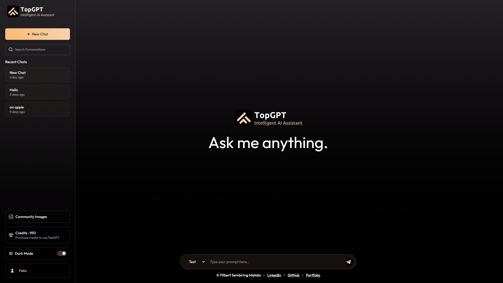

<div align="center">
  
  
  <br />
  <br />

  # 🌟 TopGPT (Project Gaia 2.0)
  **The Next Generation AI Assistant Ecosystem**

  [](https://vitejs.dev/)
  [](https://reactjs.org/)
  [](https://nodejs.org/)
  [](https://www.mongodb.com/)
  [](https://tailwindcss.com/)
  [](https://stripe.com/)

  *A full-stack, AI-powered conversational and generative image application built for speed, security, and accuracy.*
</div>

---

## 📖 Overview

**TopGPT** (internally known as Project Gaia 2.0) is a comprehensive AI assistant platform designed to unify powerful text-generation and image-generation capabilities within a singular, highly optimized interface. Built with the MERN stack (MongoDB, Express, React, Node.js), TopGPT allows users to seamlessly branch conversational logic, prompt complex text models, and generate high-fidelity AI imagery. 

A core feature is the **TopGPT Community Page**, serving as a public gallery where users can publish their best AI-generated visual content directly from the chat interface.

The application strictly adheres to modern Core Web Vitals, dynamic SEO meta tagging, and rigorous backend API security protocols (including Stripe Webhook verification and JWT authentication scopes).

---

## ✨ Core Features

*   **⚡ Context-Aware Intelligence:** Integrated with Google Gemini 2.5 Flash via standard LLM API pipelines, fine-tuned with customized system prompts handling strict reference datasets (JSON).
*   **🎨 Multi-Modal Image Generation:** Users can flip from Text to Image generation inside the exact same chat interface. 
*   **🌐 Community Publishing Pipeline:** Built-in social sharing enabling users to opt-in and publish Generated Images to a public community board.
*   **💳 Stripe Micro-Economy:** A custom credit system handling tiered access ("Basic", "Pro", "Premium"). Transactions are fully managed via secure Stripe Webhooks validating `payment_intent.succeeded` events asynchronously.
*   **🔒 Secure Identity & Data:** Real-time JWT (JSON Web Token) authentication, utilizing Bcrypt-hashed passwords and strictly enforced Express middleware protection for all user-mutating routes.
*   **📱 Responsive & Accessible UI:** Designed from the ground up using Tailwind CSS 4, featuring native theme toggling (Dark/Light Mode), semantic HTML markup, and screen-reader compliant interface architecture.

---

## 🏗️ Architecture Design

The repository follows a strict monorepo-style structure separating the frontend presentation logic from the backend service layer.

### Directory Structure
```text
gaia-2.0/
├── client/           # React 19 Frontend Environment (Vite)
└── server/           # Node.js + Express Backend Services
```

> **Detailed documentation is available inside each module:**
> - [Client (Frontend) Documentation](./client/README.md)
> - [Server (Backend) Documentation](./server/README.md)

---

## 🚀 Getting Started

### Prerequisites
Make sure you have the following installed on your local development machine:
- **Node.js** (v18.x or newer)
- **NPM** or **Yarn**
- **MongoDB** (Local instance or MongoDB Atlas Connection String)

### 1. Installation

Clone the repository and install dependencies sequentially.

```bash
# Clone the repository
git clone https://github.com/FilbertSM/gaia-2.0.git
cd gaia-2.0

# Install Server dependencies
cd server
npm install

# Install Client dependencies
cd ../client
npm install
```

### 2. Environment Variables

Both the `client` and `server` require specific environment configurations to run properly. 

Navigate to the respective directories and set up the `.env` variables (refer to the inner `README.md` files for the exact keys required for Stripe, MongoDB, ImageKit, and OpenAI).

### 3. Startup

You will need two terminal windows to run the application concurrently.

**Terminal 1 (Backend):**
```bash
cd server
npm run server
```

**Terminal 2 (Frontend):**
```bash
cd client
npm run dev
```

---

## 👨‍💻 Creator

**Filbert Sembiring Meliala**  
*Dedicated Informatics student passionate about AI and scalable digital creation.*

- **Portfolio:** [filbertsm.vercel.app](https://filbertsm.vercel.app/)
- **LinkedIn:** [Filbert Sembiring Meliala](https://www.linkedin.com/in/filbert-sembiring-meliala/)
- **GitHub:** [@FilbertSM](https://github.com/FilbertSM)

---

*If you're not prepared to be wrong, you'll never come up with anything original.* — Robert Greene
